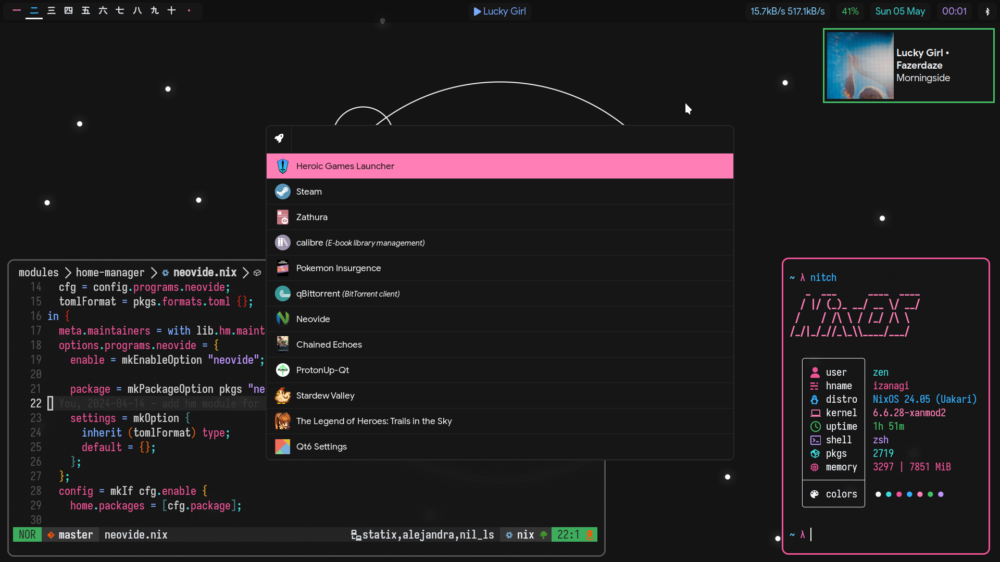

<h2 align="center">:snowflake: Zen's Flakes :snowflake:</h2>

    
    
    
  </a>

This contains the nix flakes to build an identical copy of my system.

previous iterations are in [resources](./resources/).
wallpapers are in [resources/wallpapers](./resources/wallpapers). *mostly just odoriko backgrounds*

## NIX Components
- [flakes](https://nixos.wiki/wiki/Flakes) - channel manager
- [home-manager](https://github.com/nix-community/home-manager) - manage dots
- [stylix](https://github.com/danth/stylix) - auto themer
- [nix-colors](https://github.com/Misterio77/nix-colors) - base 16 scheme
- [nixvim](https://github.com/nix-community/nixvim) - nvim config in nix
- [nur](https://github.com/nix-community/NUR) - nix user repository
- [nh](https://github.com/viperML/nh) - nix helper
- [nix-output-monitor](https://github.com/maralorn/nix-output-monitor) - better nix commands

## Programs Used
- [Hyprland](https://github.com/hyprwm/Hyprland) - compositor
- [emacs](https://www.gnu.org/emacs) - secondary main text editor
- [neovim](https://github.com/neovim/neovim) - primary main text editor
- [neovide](https://github.com/neovide/neovide) - neovim gui
- [foot](https://codeberg.org/dnkl/foot) - terminal
- [waybar](https://github.com/Alexays/Waybar) - status bar
- [yazi](https://github.com/sxyazi/yazi) - tui file manager
- [zellij](https://github.com/zellij-org/zellij/) - terminal session manager
- [btop](https://github.com/aristocratos/btop) - resources monitor
- [zathura](https://pwmt.org/projects/zathura/) - pdf/epub viewer
- [mpv](https://github.com/mpv-player/mpv) - media player(da goat)
- [zsh](http://www.zsh.org/) - shell
- [direnv](https://github.com/nix-community/nix-direnv) - auto env switcher
- [rofi](https://github.com/davatorium/rofi) - custom launcher
- [spotify-player](https://github.com/aome510/spotify-player) - spotify tui(love it)
- [calibre](https://github.com/kovidgoyal/calibre) - ebook manager
- [fcitx5](https://github.com/fcitx/fcitx5) - japanese input
- [mako](https://github.com/emersion/mako) - notification daemon
- [fzf](https://github.com/junegunn/fzf) - fuzzy finder
- [ani-cli](https://github.com/pystardust/ani-cli) - anime tool

## Rusty Tools Used
- [eza](https://github.com/eza-community/eza) - ls alter
- [duf](https://github.com/muesli/duf) - df alter
- [zoxide](https://github.com/ajeetdsouza/zoxide) - smarter cd
- [dust](https://github.com/bootandy/dust) - du alter
- [fd](https://github.com/sharkdp/fd) - find alter
- [rg](https://github.com/BurstSushi/ripgrep) - grep alter

## Standardised Config
- [oxocarbon](https://github.com/nyoom-engineering/base16-oxocarbon) - base16 theme
- [iosevka](https://github.com/be5invis/Iosevka) - monospace font
- [google-sans](https://github.com/hprobotic/Google-Sans-Font) - "everything else" font
- [umeboshi](http://font.xxenxx.net/umeboshifont.html) - "everything else" font for weebs
- [noto-color-emoji](https://fonts.google.com/specimen/Noto+Color+Emoji) - "everything else" font for normies
