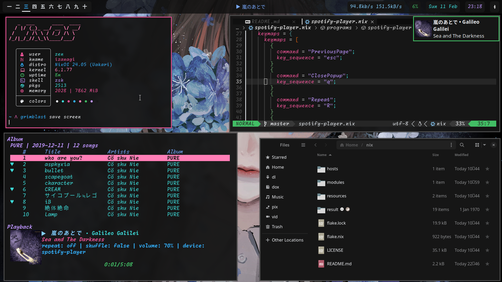

<h2 align="center">:snowflake: Zen's Flakes :snowflake:</h2>

    
    
  </a>

This contains the nix flakes to build an identical copy of my system

## NIX Components
- [flakes](https://nixos.wiki/wiki/Flakes)
- [home-manager](https://github.com/nix-community/home-manager) - manage dots
- [stylix](https://github.com/danth/stylix) - auto theme 
- [nix-colors](https://github.com/Misterio77/nix-colors) - base 16 scheme
- [nixvim](https://github.com/nix-community/nixvim) - nvim config in nix

## Programs Used
- [Hyprland](https://github.com/hyprwm/Hyprland) - compositor
- [nvim](https://github.com/neovim/neovim) - text editor
- [foot](https://codeberg.org/dnkl/foot) - terminal
- [waybar](https://github.com/Alexays/Waybar) - status bar
- [btop](https://github.com/aristocratos/btop) - resource monitor
- [zathura](https://pwmt.org/projects/zathura/) - pdf/epub viewer
- [mpv](https://github.com/mpv-player/mpv) - goated media player
- [zsh](http://www.zsh.org/) - shell
- [rofi](https://github.com/davatorium/rofi) - custom launcher
- [spotify-player](https://github.com/aome510/spotify-player) - spotify tui(love it)
- [calibre](https://github.com/kovidgoyal/calibre) - ebook manager
- [fcitx5](https://github.com/fcitx/fcitx5) - japanese input
- [mako](https://github.com/emersion/mako) - notification daemon
- [fzf](https://github.com/junegunn/fzf) - fuzzy finder

## Rusty Tools Used
- [eza](https://github.com/eza-community/eza) - ls alternative
- [duf](https://github.com/muesli/duf) - df alternative
- [dust](https://github.com/bootandy/dust) - du alternative
- [fd](https://github.com/sharkdp/fd) - find alternative
- [rg](https://github.com/BurstSushi/ripgrep) - grep alternative
